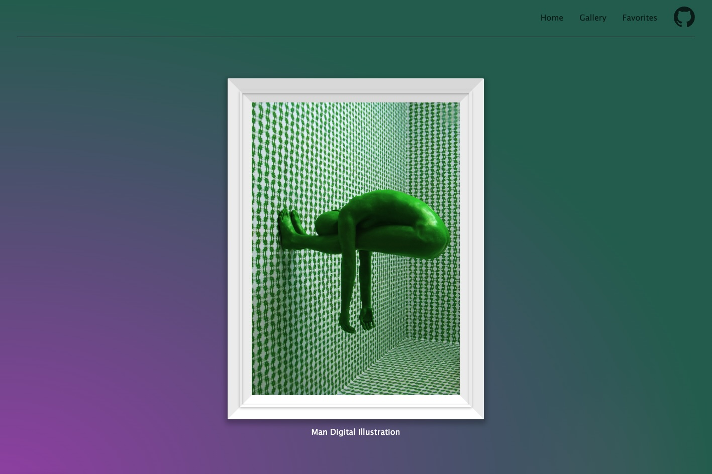
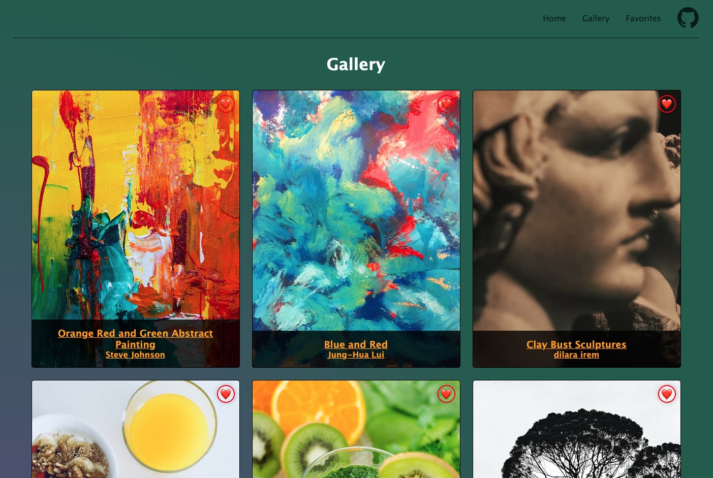
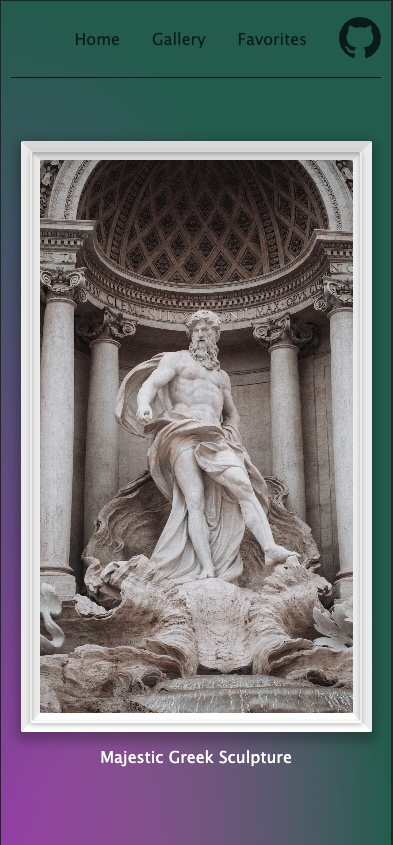
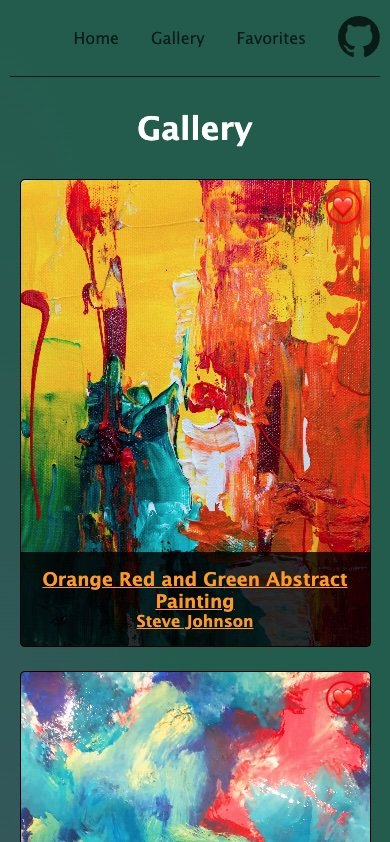

# my-gallery

Project 5 using Nextjs.

### Local development

To run project commands locally, you need to install the dependencies using `npm i` first.

You can then use the following commands:

-   `npm run dev` to start the development server
-   `npm run build` to create a production build
-   `npm run start` to start the production build
-   `npm run test` to run the tests in watch mode (if available)

> 💡 This project requires a bundler. You can use `npm run dev` to start the development server. You can then view the project in the browser at `http://localhost:3000`. The Live Preview Extension for Visual Studio Code will **not** work for this project.

### 🖥️ Desktop

#### Home

#### Gallery

### 📱 Mobile

#### Home

#### Gallery

